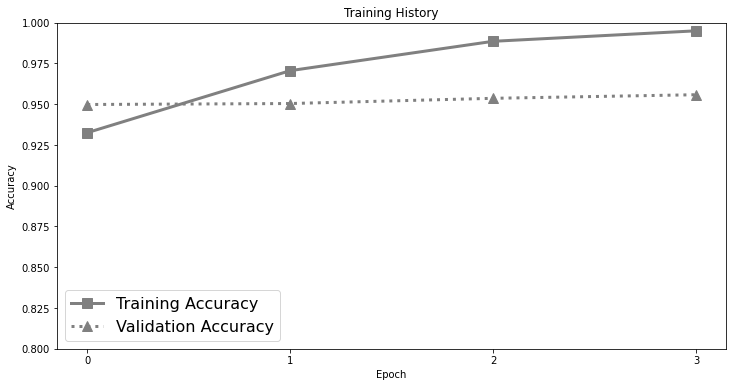
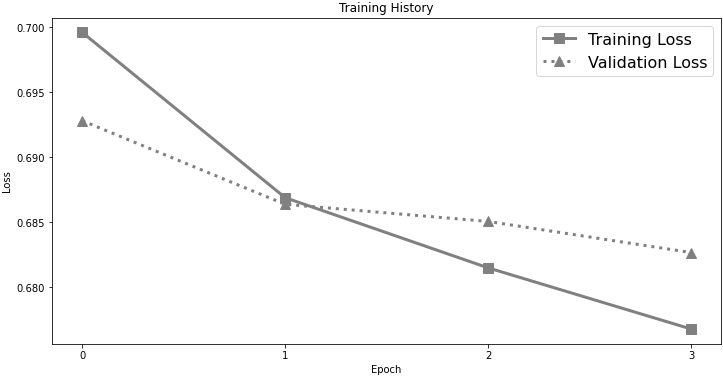

[](https://colab.research.google.com/drive/1QC_W9IHGrvhs06hfWUX86-tp0LmSX4Lp?usp=sharing)

# [Analysis of the evolution of advanced transformer-based language models: experiments on opinion mining](http://doi.org/10.11591/ijai.v12.i4.pp1995-2010)

**Abstract**
> Opinion mining, also known as sentiment analysis, is a subfield of natural language processing (NLP) that focuses on identifying and extracting subjective information in textual material. This can include determining the overall sentiment of a piece of text (e.g., positive or negative), as well as identifying specific emotions or opinions expressed in the text, that involves the use of advanced machine and deep learning techniques. Recently, transformer-based language models make this task of human emotion analysis intuitive, thanks to the attention mechanism and parallel computation. These advantages make such models very powerful on linguistic tasks, unlike recurrent neural networks that spend a lot of time on sequential processing, making them prone to fail when it comes to processing long text. The scope of our paper aims to study the behaviour of the cutting-edge Transformer-based language models on opinion mining and provide a high-level comparison between them to highlight their key particularities. Additionally, our comparative study shows leads and paves the way for production engineers regarding the approach to focus on and is useful for researchers as it provides guidelines for future research subjects.
> 
## Table of Contents
- [Tech Stack](#tech-stack)
- [Repo Structure](#repo-structure)
- [Dataset](#dataset)
- [Model Results](#model-results)
- [Citation](#citation)
- [Contact Info](#contact-info)

## Tech Stack
- [x] PyTorch
- [x] Hugging-Face
- [x] Transformers

## Repo Structure

```
 ...   
   ├── assets
   ├── data
   ├── notebooks
   ├── LICENSE
   └── README.md
```

##  Dataset
For experiments we used the IMDb movie reviews dataset due to its accessibility, size, balance, relevance, and preprocessing.

## Model Results

* **Model Architectures**:

|              | Encoder                                | Decoder                                | Encoder - Decoder |
|:------------:|:--------------------------------------:|:--------------------------------------:|:-----------------:|
| Arch.        |  |  | -                 |


* **Main Results:**

| Model       | Objective                  | Recall | Precision | F1   | Accuracy | GitHub Link                                                                                                                        | Google Colab                                                                                                                                                        |
|:-----------:|:--------------------------:|:------:|:---------:|:----:|:--------:|:----------------------------------------------------------------------------------------------------------------------------------:|:-------------------------------------------------------------------------------------------------------------------------------------------------------------------:|                                                                                      
| BERT        | Autoencoding               | 93.9   | 94.3      | 94.1 | 94.0     | [](./notebooks/Movie_Reviews_BERT_v1.ipynb)    | [](https://colab.research.google.com/drive/1qutjpCEzselMEZwtEocRItf01uFbCqqI?usp=sharing) |
| GPT         | Autoregressive             | 92.4   | 51.8      | 66.4 | 53.2     | [](./notebooks/Movie_Reviews_GPT.ipynb)        | [](https://colab.research.google.com/drive/1R3FcTDyMVxhuXVXU74LIuHv9VYXIET6Z?usp=sharing) |
| GPT-2       | Autoregressive             | 51.1   | 54.8      | 52.9 | 54.5     | [](./notebooks/Movie_Reviews_GPT2.ipynb)       | [](https://colab.research.google.com/drive/1HgsdNvjIA0ul02XyKXZNpzGslO4W4aj5?usp=sharing) |
| ALBERT      | Autoencoding               | 94.1   | 91.9      | 93.0 | 93.0     | [](./notebooks/Movie_Reviews_ALBERT.ipynb)     | [](https://colab.research.google.com/drive/1ZPX7ghkndl_lC9jiOxavGBqKQyt2N4FI?usp=sharing) |
| RoBERTa     | Autoencoding               | 96.0   | 94.6      | 95.3 | 95.3     | [](./notebooks/Movie_Reviews_RoBERTa.ipynb)    | [](https://colab.research.google.com/drive/1qKFMWTT6Qqrwa377hB503nXIOx7DxeMD?usp=sharing) |
| XLNet       | Autoregressive             | 94.7   | 95.1      | 94.9 | 94.8     | [](./notebooks/Movie_Reviews_XLNet.ipynb)      | [](https://colab.research.google.com/drive/1ZwwKB7Kym6Z1KYy7_YI8jiZrAjPxFMVG?usp=sharing) |
| DistilBERT  | Autoencoding               | 94.3   | 92.7      | 93.5 | 93.4     | [](./notebooks/Movie_Reviews_DistilBERT.ipynb) | [](https://colab.research.google.com/drive/1n84zEJcnVZAEhcolYnNzIJS7U5Z4RFbU?usp=sharing) |
| XLM-RoBERTa | Autoencoding               | 83.1   | 71.7      | 77.0 | 75.2     | [](./notebooks/Movie_Reviews_BERT.ipynb)       | [](./all/Movie_Reviews_BERT.ipynb)                                                        |
| BART        | Encoder-Decoder            | 96.0   | 93.3      | 94.6 | 94.6     | [](./notebooks/Movie_Reviews_BART.ipynb)       | [](https://colab.research.google.com/drive/1wsNwUFu4WxOK9uwRv8P5kw__-MxTxReh?usp=sharing) |
| ConvBERT    | Autoencoding               | 95.5   | 93.7      | 94.6 | 94.5     | [](./notebooks/Movie_Reviews_ConvBERT.ipynb)   | [](https://colab.research.google.com/drive/11TH0XbLEkF71KlAWcsqNGWllTBPqT8RP?usp=sharing) |
| DeBERTa     | Autoencoding               | 95.2   | 95.0      | 95.1 | 95.1     | [](./notebooks/Movie_Reviews_DeBERTa.ipynb)    | [](https://colab.research.google.com/drive/1YrB7ObTrLhRatSXclpwXjG69cN1L6OrM?usp=sharing) |
| ELECTRA     | Generative -Discriminative | 95.8   | 95.4      | 95.6 | 95.6     | [](./notebooks/Movie_Reviews_ELECTRA.ipynb)    | [](https://colab.research.google.com/drive/1QC_W9IHGrvhs06hfWUX86-tp0LmSX4Lp?usp=sharing) |
| Longformer  | Autoregressive             | 95.9   | 94.3      | 95.1 | 95.0     | [](./notebooks/Movie_Reviews_Longformer.ipynb) | [](https://colab.research.google.com/drive/1nY01nkwZr3woLQHi3_5faE2x97HrEB_p?usp=sharing) |
| Reformer    | Autoregressive             | 54.6   | 52.1      | 53.3 | 52.2     | [](./notebooks/Movie_Reviews_Reformer.ipynb)   | [](https://colab.research.google.com/drive/1XexBkibhJ4I4KNYHUwNj8l8sXtFeJwQ_?usp=sharing) |
| T5          | Encoder-Decoder            | 94.8   | 93.4      | 94.0 | 93.9     | [](./notebooks/Movie_Reviews_T5.ipynb)         | [](https://colab.research.google.com/drive/1MOWku1qdFacJItcGYkVvOpngMq417FIk?usp=sharing) |

* **Ablation Results**:


| Model | Max Len | Data Cleaned | Recall | Precision | F1   | Accuracy | GitHub Link                                                                                                                     | Google Colab                                                                                                                                                        |
|:-----:|:-------:|:------------:|:------:|:---------:|:----:|:--------:|:-------------------------------------------------------------------------------------------------------------------------------:|:-------------------------------------------------------------------------------------------------------------------------------------------------------------------:|
| BERT  | 64      | []           | 86.8   | 84.7      | 85.8 | 85.6     | [](./notebooks/Movie_Reviews_BERT_v1.ipynb) | [](https://colab.research.google.com/drive/1qutjpCEzselMEZwtEocRItf01uFbCqqI?usp=sharing) |
| BERT  | 384     | []           | 93.9   | 94.3      | 94.1 | 94.0     | [](./notebooks/Movie_Reviews_BERT_v1.ipynb) | [](https://colab.research.google.com/drive/1qutjpCEzselMEZwtEocRItf01uFbCqqI?usp=sharing) |
| BERT  | 384     | [x]          | 92.6   | 91.6      | 92.1 | 92.2     | [](./notebooks/Movie_Reviews_BERT_v1.ipynb) | [](https://colab.research.google.com/drive/1qutjpCEzselMEZwtEocRItf01uFbCqqI?usp=sharing) |


* **Best vs. Worsd Model:**

| Model   | Perf.       | Accuracy                               | Loss                                   | Confusion                              |
|:-------:|:-----------:|:--------------------------------------:|:--------------------------------------:|:--------------------------------------:|
| ELECTRA | Best        |  |  |  | 
| GPT2    | Worst       |          |          |          |


## Citation
```
@article{Zekaoui_2023,
  title = {Analysis of the evolution of advanced transformer-based language models: experiments on opinion mining},
  author = {Nour Eddine Zekaoui and Siham Yousfi and Maryem Rhanoui and Mounia Mikram},
  journal = {{IAES} International Journal of Artificial Intelligence ({IJ}-{AI})},
  volume = {12},
  number = {4},
  pages = {1995--2010}
  month = {Dec},
  year = {2023},
  doi = {10.11591/ijai.v12.i4.pp1995-2010},
  ISSN = {2252-8938},
  url = {https://doi.org/10.11591/ijai.v12.i4.pp1995-2010},
}
```

## Contact Info
For help or issues using the paper's code, please submit a GitHub **[issue](https://github.com/zekaouinoureddine/Advanced-transformer-based-models-on-opinion-mining/issues)**. For personal communication related to the paper, please contact: `{nour-eddine.zekaoui, syousfi, mrhanoui, mmikram}@esi.ac.ma` .

