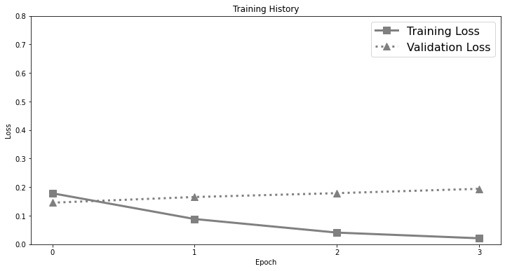
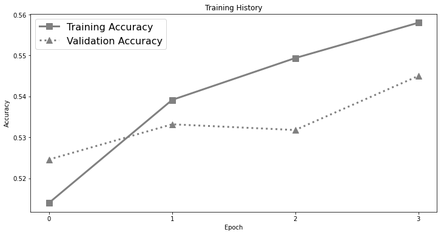

# Advanced Transformer-Based Models: Experiments on Opining Mining

In `Analysis of the Evolution of Advanced Transformer-based Language Models: Experiments on Opening Mining`, we analyzed Transformer-based models. Further, we performed experiments on the IMDb dataset to help researchers and production engineers to which approach they should pay more attention.

## Table of Contents
- [Tech Stack](#tech-stack)
- [Repo Blocks](#tech-structure)
- [Dataset](#dataset)
- [Model Results](#model-results)
- [Citation](#citation)
- [Contact Info](#contact-info)

## Tech Stack
- [x] PyTorch
- [x] Hugging-Face
- [x] Transformers

## Repo Structure

```
 ...   
   ├── assets
   ├── data
   ├── notebooks
   └── README.md
```

##  Dataset
For experiments we used the IMDb movie reviews dataset due to its accessibility, size, balance, relevance, and preprocessing.

## Model Results

* **Model Architectures**:

|              | Encoder                                | Decoder                                | Encoder-Decoder |
|:------------:|:--------------------------------------:|:--------------------------------------:|:---------------:|
| Arch.        |  |  | -               |


* **Main Results:**

| Model       | Objective                  | Recall | Precision | F1   | Accuracy | GitHub Link                                                                                                                        | Google Colab                                                                                                                                                        |
|:-----------:|:--------------------------:|:------:|:---------:|:----:|:--------:|:----------------------------------------------------------------------------------------------------------------------------------:|:-------------------------------------------------------------------------------------------------------------------------------------------------------------------:|                                                                                      
| BERT        | Autoencoding               | 93.9   | 94.3      | 94.1 | 94.0     | [](./all/Movie_Reviews_BERT_v1.ipynb)    | [](https://colab.research.google.com/drive/1qutjpCEzselMEZwtEocRItf01uFbCqqI?usp=sharing) |
| GPT         | Autoregressive             | 92.4   | 51.8      | 66.4 | 53.2     | [](./all/Movie_Reviews_GPT.ipynb)        | [](https://colab.research.google.com/drive/1R3FcTDyMVxhuXVXU74LIuHv9VYXIET6Z?usp=sharing) |
| GPT-2       | Autoregressive             | 51.1   | 54.8      | 52.9 | 54.5     | [](./all/Movie_Reviews_GPT2.ipynb)       | [](https://colab.research.google.com/drive/1HgsdNvjIA0ul02XyKXZNpzGslO4W4aj5?usp=sharing) |
| ALBERT      | Autoencoding               | 94.1   | 91.9      | 93.0 | 93.0     | [](./all/Movie_Reviews_ALBERT.ipynb)     | [](https://colab.research.google.com/drive/1ZPX7ghkndl_lC9jiOxavGBqKQyt2N4FI?usp=sharing) |
| RoBERTa     | Autoencoding               | 96.0   | 94.6      | 95.3 | 95.3     | [](./all/Movie_Reviews_RoBERTa.ipynb)    | [](https://colab.research.google.com/drive/1qKFMWTT6Qqrwa377hB503nXIOx7DxeMD?usp=sharing) |
| XLNet       | Autoregressive             | 94.7   | 95.1      | 94.9 | 94.8     | [](./all/Movie_Reviews_XLNet.ipynb)      | [](https://colab.research.google.com/drive/1ZwwKB7Kym6Z1KYy7_YI8jiZrAjPxFMVG?usp=sharing) |
| DistilBERT  | Autoencoding               | 94.3   | 92.7      | 93.5 | 93.4     | [](./all/Movie_Reviews_DistilBERT.ipynb) | [](https://colab.research.google.com/drive/1n84zEJcnVZAEhcolYnNzIJS7U5Z4RFbU?usp=sharing) |
| XLM-RoBERTa | Autoencoding               | 83.1   | 71.7      | 77.0 | 75.2     | [](./all/Movie_Reviews_BERT.ipynb)       | [](./all/Movie_Reviews_BERT.ipynb)                                                        |
| BART        | Encoder-Decoder            | 96.0   | 93.3      | 94.6 | 94.6     | [](./all/Movie_Reviews_BART.ipynb)       | [](https://colab.research.google.com/drive/1wsNwUFu4WxOK9uwRv8P5kw__-MxTxReh?usp=sharing) |
| ConvBERT    | Autoencoding               | 95.5   | 93.7      | 94.6 | 94.5     | [](./all/Movie_Reviews_ConvBERT.ipynb)   | [](https://colab.research.google.com/drive/11TH0XbLEkF71KlAWcsqNGWllTBPqT8RP?usp=sharing) |
| DeBERTa     | Autoencoding               | 95.2   | 95.0      | 95.1 | 95.1     | [](./all/Movie_Reviews_DeBERTa.ipynb)    | [](https://colab.research.google.com/drive/1YrB7ObTrLhRatSXclpwXjG69cN1L6OrM?usp=sharing) |
| ELECTRA     | Generative -Discriminative | 95.8   | 95.4      | 95.6 | 95.6     | [](./all/Movie_Reviews_ELECTRA.ipynb)    | [](https://colab.research.google.com/drive/1QC_W9IHGrvhs06hfWUX86-tp0LmSX4Lp?usp=sharing) |
| Longformer  | Autoregressive             | 95.9   | 94.3      | 95.1 | 95.0     | [](./all/Movie_Reviews_Longformer.ipynb) | [](https://colab.research.google.com/drive/1nY01nkwZr3woLQHi3_5faE2x97HrEB_p?usp=sharing) |
| Reformer    | Autoregressive             | 54.6   | 52.1      | 53.3 | 52.2     | [](./all/Movie_Reviews_Reformer.ipynb)   | [](https://colab.research.google.com/drive/1XexBkibhJ4I4KNYHUwNj8l8sXtFeJwQ_?usp=sharing) |
| T5          | Encoder-Decoder            | 94.8   | 93.4      | 94.0 | 93.9     | [](./all/Movie_Reviews_T5.ipynb)         | [](https://colab.research.google.com/drive/1MOWku1qdFacJItcGYkVvOpngMq417FIk?usp=sharing) |

* **Ablation Results**:


| Model | Max Len | Data Cleaned | Recall | Precision | F1   | Accuracy | GitHub Link                                                                                                                     | Google Colab                                                                                                                                                        |
|:-----:|:-------:|:------------:|:------:|:---------:|:----:|:--------:|:-------------------------------------------------------------------------------------------------------------------------------:|:-------------------------------------------------------------------------------------------------------------------------------------------------------------------:|
| BERT  | 64      | []           | 86.8   | 84.7      | 85.8 | 85.6     | [](./all/Movie_Reviews_BERT_v1.ipynb) | [](https://colab.research.google.com/drive/1qutjpCEzselMEZwtEocRItf01uFbCqqI?usp=sharing) |
| BERT  | 384     | []           | 93.9   | 94.3      | 94.1 | 94.0     | [](./all/Movie_Reviews_BERT_v1.ipynb) | [](https://colab.research.google.com/drive/1qutjpCEzselMEZwtEocRItf01uFbCqqI?usp=sharing) |
| BERT  | 384     | [x]          | 92.6   | 91.6      | 92.1 | 92.2     | [](./all/Movie_Reviews_BERT_v1.ipynb) | [](https://colab.research.google.com/drive/1qutjpCEzselMEZwtEocRItf01uFbCqqI?usp=sharing) |


* Best vs. Worsd Model:

| Model   | Performance | Accuracy                               | Loss                                   | Confusion                              |
|:-------:|:-----------:|:--------------------------------------:|:--------------------------------------:|:--------------------------------------:|
| ELECTRA | Best Model  |  |  |  |
| GPT2    | Worst Model |          |          |          |


## Citation

To cite the paper, use the BibTeX snippet below:

```
@article{zekaoui2022analysis,
  title={Analysis of the Evolution of Advanced Transformer-based Language Models: Experiments on Opining Mining},
  author={Nour Eddine, Zekaoui and Siham, Yousfi and Maryem, Rhanoui and Mounia, Mikram},
  journal={IAES International Journal of Artificial Intelligence (IJ-AI)},
  year={2022}
}
```

## Contact Info
For help or issues using the paper's code, please submit a GitHub **issue**. For personal communication related to the paper, please contact: `{nour-eddine.zekaoui, syousfi, mrhanoui, mmikram}@esi.ac.ma` .

